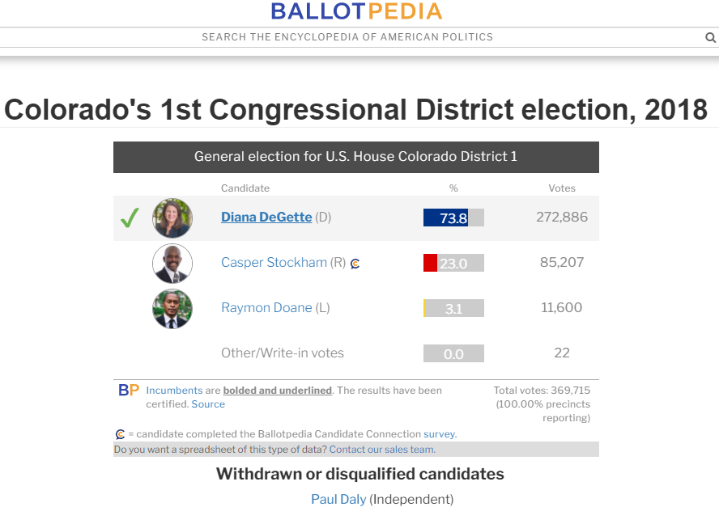

## Written Analysis of Election Audit

# Overview of Election Audit
A Colorado Board of Elections employee gave me tasks to complete the election audit of a recent local congressional election. The take was to sum of the votes of each candidate to determine who received the most popular votes. The candidate with the most popular votes was declared the winner. The audit also summed up the votes tallied in each county in the district.

This election was the 1st Congressional District in Colorado in 2018. The district encompassed the City and County of Denver and parts of two adjacent counties, Jefferson and Arapaho. 

