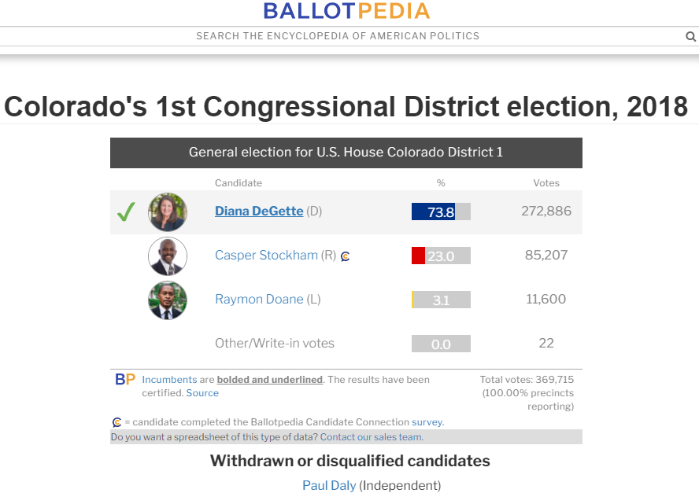
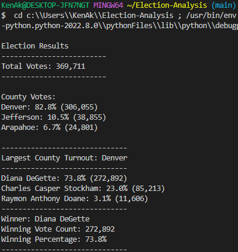
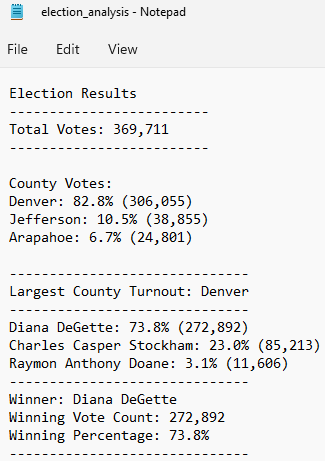

## Written Analysis of Election Audit

# Overview of Election Audit
A Colorado Board of Elections employee gave me tasks to complete the election audit of a recent local congressional election. The task was to sum of the votes of each candidate to determine who received the most popular votes. The candidate with the most popular votes was declared the winner. The audit also summed up the votes tallied in each county in the district.

This election was the 1st Congressional District in Colorado in 2018. The district encompasses the City and County of Denver and parts of two adjacent counties, Jefferson and Arapahoe. Below are the published election results from the website Ballotpedia.org:

Below are outputs of the Python script to audit the data presented on the terminal, and the same output written to a text file:

 

# Election Audit Results

⚫There were 369,711 votes case, according to the data in the file election_results.csv tabulated by the Python script.

⚫82.8% of the votes were cast in Denver County, 10.5% in Jefferson County, and 6.7% in Arapahoe County.

⚫Most of the votes (over 82%) were cast by voters in Denver County.

⚫Diana DeGette won the election with 73.8% of the vote (272,892 votes out of 369,711 cast), followed by Charles Stockham with 23.0% (85,213 votes) and Raymon Doane with 3.1% (11,606).

The results presented on Ballotpedia.org added six votes to each candidate from the tallies calculted by the Python audit. The Ballotpedia table also included 22 write-in votes or votes for others. This table presented a total vote tally of 369,715.

These 22 "other" votes were not in the data file election_results.csv, which had 369,711 lines of voting data. It appeared to me that 18 of these 22 "other" votes were distributed evenly to each of the three candidates, adding six votes to each of their tallies. The other four votes out of the 22 apparently were disregarded. 

Since this was not a close election, adding six votes to each candidate did not change the final results, but it could have been significant if the election was very close.

# Election Audit Summary
There are at least two examples of how this script can be modified to be used for other elections. The first thing I did was to modify the original script to present the candidates in the order of their vote tallies. Thus, the presentation of the candidates was more logical, in order by the winner (DeGette) followed by Stockham and Doane, respectively. I found the method to sort the data by vote count by doing a web search to find the right code.

A second way this script can be modified would be to analyze the percentage of votes each candidate earned in each respective county, or in greater detail by going down to smaller jurisdictions such as cities and town, or to the precinct level. I performed a pivot table analysis on election_results.csv in Excel to determine the percentage of the vote each candidate earned in each county. This revealed that while Diana DeGette won the election in a landslide with over 73% of the vote, she would have run a strong risk of losing the election had the boundaries of the district had been drawn differently.

Most of the district encompasses the City and County of Denver, and DeGette was very strong in this jurisdiction. In the part of the district in Jefferson County, her leading opponent Charles Stockham actually earned the majority of the vote. However, it did not change the overall election results significantly, because voters in Jefferson County only cast about 10% of the overall votes.

Therefore, if the district boundaries changed to encompass more suburban neighborhoods such as in Jefferson County or if DeGette moved outside of Denver to run for Congress in a suburban or rural district where majority of voters have different political leanings, then she would run a risk of losing, despite her strong performance in her current home district. Stockham can use the results of his strong performance in Jefferson County to seek election in a predominantly suburban district where the majority of voters would likely agree with him and he could win the election. 
